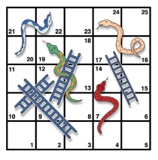

```{r setup, include=FALSE}

knitr::opts_chunk$set(echo = TRUE, messages=TRUE, error=TRUE) 

```


# Easy Practice Problems

## 1. Do simple math with numbers, addition, subtraction, multiplication, division

```{r}
1+1
89392-8373 
4*3
122/12
```


## 2. Put numbers into variables, do simple math on the variables
```{r}
mel <-1
other<-23456789
a<-1
b<-20
c<-40

a+b

c-b

other/c 

(a+c)/b

```


## 3. Write code that will place the numbers 1 to 100 separately into a variable using for loop. Then, again using the seq function.

```{r}
for(i in 1:100)
print (i)


seq(1,100)
```


## 4. Find the sum of all the integer numbers from 1 to 100.
```{r}
sum(i)

sum(1:100)

sum(seq(1,100))
```


## 5. Write a function to find the sum of all integers between any two values.
```{r}
sum(1:100)
sum(5:500)
sum(2:4)
```


## 6. List all of the odd numbers from 1 to 100.
```{r}
EvenNumbers<-c()
for(i in 1:100){
if (i%%2 ==0){
EvenNumbers<-c(EvenNumbers,i)
}
}

EvenNumbers
```


## 7. List all of the prime numbers from 1 to 1000.
```{r}
AllNumbers<-c()
for(i in 1:1000){
  AllNumbers<-c(AllNumbers,i)
}
PrimeNumbers<-c()
for (j in AllNumbers){
  if(j %/% 2 || j%/% 3)
    PrimeNumbers<-c(AllNumbers,j)
}

PrimeNumbers
```

```{r}
sieve <- function(n)
{
   n <- as.integer(n)
   if(n > 1e6) stop("n too large")
   primes <- rep(TRUE, n)
   primes[1] <- FALSE
   last.prime <- 2L
   for(i in last.prime:floor(sqrt(n)))
   {
      primes[seq.int(2L*last.prime, n, last.prime)] <- FALSE
      last.prime <- last.prime + min(which(primes[(last.prime+1):n]))
   }
   which(primes)
}

 sieve(1000)
```

## 8.Generate 100 random numbers
```{r}
sample(1:1000000, 100, replace=FALSE)
sample(1:10000, 100, replace=TRUE)
```


## 9. Generate 100 random numbers within a specific range
```{r}
sample(20:400, 100, replace=FALSE)
```


## 10.Write your own functions to give descriptive statistics for a vector variable storing multiple numbers. Write functions for the following without using R intrinsics: mean, mode, median, range, standard deviation

```{r}
a<-c(2,4,6,8,10,12,14,16)
b<-c(2,4,4,6)

neam<- function (x){
  (sum(x))/length(x)
}

edom<- function(x){
  x[duplicated(x)]}


naidem<- function (x){
  x[length(x)/2]
}


egnar<- function (x){
  (x[length(x)])-(x[1])
}

sumsquares<- function(x){
 sum((x-neam(x))^2) 
}


vednats<- function(x){
  sqrt(sumsquares(x)/length(x))
}
  

vednats(a)


```
## 11. Count the number of characters in a string variable


```{r}
Captain<- c("pickles", "is", "the", "best", "cat")
Class<-c( "this class is comprised of learning r")

nchar(Class)
nchar (Captain)

```

## 12. Count the number of words in a string variable


```{r}
sapply(strsplit(Class, " "), length)
sapply(strsplit(Captain, " "), length)

```


## 13. Count the number of sentences in a string variable

```{r}
paragraph<-c("A paragraph is a brief piece of writing that's around seven to ten sentences long. It has a topic sentence and supporting sentences that all relate closely to the topic sentence. The paragraph form refers to its overall structure, which is a group of sentences focusing on a single topic.")

sapply(strsplit(paragraph, "[.]"), length)

strsplit(paragraph, "[.]")
```


## 14. Count the number of times a specific character occurs in a string variable

```{r}
sapply(strsplit(paragraph, "paragraph"), length)
sapply(strsplit(paragraph, "n"), length)
```


## 15. Do a logical test to see if one word is found within the text of another string variable.

```{r}
a==b
a!=Captain
word<-"fart" 
word==Captain
word==paragraph
strsplit(paragraph,split=" ")
strsplit(Captain,split=" ")
Captain==paragraph

Captain%in%paragraph 

```
*not currently reading the all of the text within paragraph. should it be able to do that? 


## 16. Put the current computer time in milliseconds into a variable

```{r}
print(as.numeric(Sys.time())*1000, digits=10)
time<- c(print(as.numeric(Sys.time())*1000, digits=10))
```
I can't read milliseconds so let's try it normally... 

```{r}
time<- c(time, print(as.numeric(Sys.time())*100, digits=10))
Sys.time()

time<-c(Sys.time())
print (time)

```


## 17. Measure how long a piece of code takes to run by measuring the time before the code is run, and after the code is run, and taking the difference to find the total time

```{r}
time1<- print(as.numeric(Sys.time())*1000, digits=10)

seq(10000000)

time2 <- print(as.numeric(Sys.time())*1000, digits=10)

time2-time1 
```

## 18. Read a .txt file or .csv file into a variable

```{r}

breweries <- read.csv("Breweries .csv")
HistoryOfBeer <- read.delim("TestFile.txt")

```


## 19. Output the contents of a variable to a .txt file

```{r}

write(AllNumbers, file = "data.txt",
      ncolumns = 1,
      append = FALSE, sep = " ")

```


## 20. Create a variable that stores a 20x20 matrix of random numbers
```{r}
# ?matrix

mat <- matrix(data = rexp(200, rate = 10), nrow = 20, ncol = 20)

matr<-matrix(data = rnorm(4000, mean = 25, sd = 5), nrow = 20, ncol = 20)

# ?rexp
# ?Normal

```
##21. Output any matrix to a txt file using commas or tabs to separate column values, and new lines to separate row values


```{r}
write(matr, file = "matr.csv",
      ncolumns = 20,
      append = FALSE, sep = " ")
```

# Harder Practice Problems
## 1. The FizzBuzz Problem. List the numbers from 1 to 100 with the following constraints. If the number can be divided by three evenly, then print Fizz instead of the number. If the number can be divided by five evenly, then print Buzz instead of the number. Finally, if the number can be divided by three and five evenly, then print FizzBuzz instead of the number.


for(m in 1:100){
  if (m == 1:100)
    FB[m]<-as.integer(m)
}

```{r}
FB <- c(1:100) 

for (i in 1:100) {
 if (i%%3==0)
   FB[i]<-"Fizz"
}
for (j in 1:100){
  if (j%%5==0)
    FB[j]<-"Buzz"
}
for (k in 1:100){
  if (k%%3 ==0 & k%%5 == 0)
    FB[k]<-"FizzBuzz"
  }

```
## 2. Frequency Counts Take text as input, and be able to produce a table that shows the counts for each character in the text. This problem is related to the earlier easy problem asking you to count the number of times that a single letter appears in a text. The slightly harder problem is the more general version: count the frequencies of all unique characters in a text.

table((unlist(strsplit(paragraph,""))recursive = FALSE, use.names = TRUE)
      
unlist(strsplit(paragraph,"")), recursive = FALSE, use.names = TRUE)

```{r}
table(unlist(strsplit(paragraph,"")))

table(unique(unlist(strsplit(paragraph,""), recursive = FALSE, use.names = TRUE)))

```


## 3. Test the Random Number Generator Test the random number generator for a flat distribution. Generate a few million random numbers between 0 and 100. Count the number of 0s, 1s, 2s, 3s, etc. all the way up to 100. Look at the counts for each of the numbers and determine if they are relatively equal. For example, you could plot the counts in Excel to make a histogram. If all of the bars are close to being flat, then each number had an equal chance of being selected, and the random number generator is working without bias.
```{r, eval=F}
distribution<-runif(10000000, min=0, max=100)
table(unlist(distribution))
hist(distribution)
```


## 4. Create a multiplication table Generate a matrix for a multiplication table. For example, the labels for the columns could be the numbers 1 to 10, and the labels for the rows could be the numbers 1 to 10. The contents of each of the cells in the matrix should be correct answer for multiplying the column value by the row value.

```{r}

row<-c(1, 2, 3, 4, 5, 6, 7, 8, 9, 10)
column<-c(1, 2, 3, 4, 5, 6, 7, 8, 9, 10)


multiplycol<-function(x){
   row[1:10]*column[x]
}
multiplycol(1)


mults<-c(multiplycol(1), multiplycol(2), multiplycol(3), multiplycol(4), multiplycol(5), multiplycol(6), multiplycol(7), multiplycol(8), multiplycol(9), multiplycol(10))


matrix(data = mults, nrow = 10, ncol = 10, byrow = TRUE, dimnames = NULL)


  
```


## 5. Encrypt and Decrypt the Alphabet Turn any normal english text into an encrypted version of the text, and be able to turn any decrypted text back into normal english text. A simple encryption would be to scramble the alphabet such that each letter corresponds to a new randomly chosen (but unique) letter.

```{r}
alphabet<-c("A", "B", "C", "D","E", "F", "G", "H","I", "J", "K", "L", "M", "N", "O", "P", "Q", "R"," S", "T"," U", "V" ,"W", "X", "Y", "Z")

encrypt<-function (x){
  for (x in 1:26)
  alphabet[x]<-c(FB[x])
}

encrypted<-c()
for(i in 1:26){
   alphabet[i]<-c(FB[i])
}

decrypted<-c()
for(i in 1:26){
   alphabet[i]<-c(letters[i])
}

letters<-c("A", "B", "C", "D","E", "F", "G", "H","I", "J", "K", "L", "M", "N", "O", "P", "Q", "R"," S", "T"," U", "V" ,"W", "X", "Y", "Z")


```


## 6. Snakes and Ladders

  
```{r 3snl, echo=FALSE,dev='png'}

```

```{r}

roll_dice<- function(x){
  return(sample(1:6, x, replace = TRUE, prob = NULL))
}

roll_dice(10)

total_sum<-0
number_of_rolls<-0
while(total_sum < 25){
  number_of_rolls <- number_of_rolls+1
  total_sum <-total_sum+sample(c(1,2,3,4,5,6),1)
}
number_of_rolls

# based on the demo in the assignment, the average number of rolls needed to finish the board is 7.5 


total_sum<-0
number_of_rolls<-0
while(total_sum < 25){
  number_of_rolls <- number_of_rolls+1
  total_sum <-total_sum+sample(c(1,2,3,4,5,6),1)
  if(total_sum==3)
    total_sum+7
  if(total_sum==4)
    total_sum+10
  if(total_sum==6)
    total_sum+11
  if(total_sum==8)
    total_sum+11
  if(total_sum==9)
    total_sum+9
  if(total_sum==10)
    total_sum+2
  if(total_sum==16)
    total_sum+8
  if(total_sum==20)
    total_sum+2
}
number_of_rolls
total_sum


save_rolls <- c()
for(sims in 1:100){
  total_sum<-0
  number_of_rolls<-0
  while(total_sum < 25){
    number_of_rolls <- number_of_rolls+1
    total_sum <-total_sum+sample(c(1,2,3,4,5,6),1)
  if(total_sum==3)
    total_sum+7
  if(total_sum==4)
    total_sum+10
  if(total_sum==6)
    total_sum+11
  if(total_sum==8)
    total_sum+11
  if(total_sum==9)
    total_sum+9
  if(total_sum==10)
    total_sum+2
  if(total_sum==16)
    total_sum+8
  if(total_sum==20)
    total_sum+2
  }
  save_rolls[sims] <- number_of_rolls
}

save_rolls

```


##7. Dice-rolling simulations. Assume that a pair of dice are rolled. Using monte carlo-simulation, compute the probabilities of rolling a 2, 3, 4, 5, 6, 7, 8, 9, 10, 11, and 12, respectively.

```{r}
roll_dice<- function(x){
  return(sample (1:6,1))
}

di1 = c(1:6)
di2 = c(1:6)
di1_sample<-sample(x = di1, size = 100, replace = TRUE)
di2_sample<-sample(x = di2, size = 100, replace = TRUE)

table(di1_sample)
table(di2_sample)

totes_sample<-di1_sample+di2_sample
data.frame(totes_sample)
possible_rolls<-c( 2,  3,  4,  5, 6, 7,  8,  9, 10, 11, 12 )
frequency<-c(3,  6,  5,  6, 21, 19,  9, 10, 12,  6,  3 )

prob<-frequency/100 

solution<-data.frame(possible_rolls, prob)
```


##8. Monte Hall problem. The monte-hall problem is as follows. A contestant in a game show is presented with three closed doors. They are told that a prize is behind one door, and two goats are behind the other two doors. They are asked to choose which door contains the prize. After making their choice the game show host opens one of the remaining two doors (not chosen by the contestant), and reveals a goat. There are now two door remaining. The contestant is asked if they would like to switch their choice to the other door, or keep their initial choice. The correct answer is that the participant should switch their initial choice, and choose the other door. This will increase their odds of winning. Demonstrate by monte-carlo simulation that the odds of winning is higher if the participant switches than if the participants keeps their original choice.

```{r}

Doors<-c("D1","D2", "D3")


xdata<- c()
for (i in 1:100000){
 prize<-sample(Doors, 1, replace = FALSE, prob = NULL)
pick<-sample(Doors, 1, replace = FALSE, prob = NULL)
open<-sample(Doors[which ((Doors != pick)&(Doors != prize))][1])
switchyes<-sample(Doors[which ((Doors != pick) & (Doors !=open))])

if (pick == prize) (xdata = c(xdata, "noswitchwin"))
if (switchyes == prize) (xdata = c(xdata, "switchwin")) 
}


length(which(xdata=="noswitchwin"))
length(which(xdata=="switchwin"))

#taken from http://www.bodowinter.com/tutorial/bw_doodling_monty_hall.pdf


```


## 9. 100 doors problem. Problem: You have 100 doors in a row that are all initially closed. You make 100 passes by the doors. The first time through, you visit every door and toggle the door (if the door is closed, you open it; if it is open, you close it). The second time you only visit every 2nd door (door 2, 4, 6, etc.). The third time, every 3rd door (door 3, 6, 9, etc.), etc, until you only visit the 100th door.

Question: What state are the doors in after the last pass? Which are open, which are closed?

```{r}
Hallway<-c(1:100)
Status<-c()
for (i in 1:100){
  Status<-c(Status, "open")
  if (Hallway[i]%%2==0)
    Status[i]<-c("closed")
}

table(Status,Hallway)
#Pass 1- All doors are open

for (i in 1:100)
  if (Hallway[i]%%2==0){
    Status[i]<-c("closed")
  }
for (i in 1:100)
  if (Hallway[i]%%3==0){
    Status[i]<-c("closed")
  if (Hallway[i]%%3==0 & Hallway[i]%%2==0)
    Status[i]<-c("open")
  }

#def not it 

```


## 10. 99 Bottles of Beer Problem In this puzzle, write code to print out the entire “99 bottles of beer on the wall”" song. For those who do not know the song, the lyrics follow this form:

```{r}
count <- 0 
verse1 <- "bottles of beer on the wall"
verse2 <- "bottles of beer"
verse3 <- "take one down and pass it around"

beers<- c(99:1)

while (count < 100){
  for (i in 1:100){
  print (beers[i]) 
  print (verse1)
  print (beers[i])
  print (verse2)
  print (verse3)
  print (beers[i+1])
  print (verse1) 
  count<- count+1}
}

```


## 11. Random Tic-Tac-Toe Imagine that two players make completely random choices when playing tic-tac-toe. Each game will either end in a draw or one of the two players will win. Create a monte-carlo simulation of this “random” version of tic-tac-toe. Out 10,000 simulations, what proportion of the time is the game won versus drawn?


```{r}

tictac<- function(x){
board<- matrix((sample(0:1, 9, replace = TRUE)), nrow=3, ncol = 3, byrow = FALSE, dimnames = NULL)
}

game<-tictac(board)
  
print(game)


draw<- 0
numgames<-0
win<- 0
line<- 0 
d<-0

repeat {
   game<-tictac(board)
   numgames<-numgames+1
   
   if ((colSums(game) == 3||0) ||
       (rowSums(game) == 3||0)) {
  line<-line+1
   }
     if ((game[1,3]==0) & (game[2,2] == 0) & (game[3,1] == 0)){
     d<- d+1
     }
   win<-abs(line-d)
if ((colSums(game)==1||2) || (rowSums (game) == 1 || 2)){
    draw<-draw+1
}

   if(numgames == 10000) {
      break
   }
}

print(win)
print(draw-win)


```


# Data-vis assignment 

### Calcutt, S. E., Proctor, D., & Berman, S. M. (2019). Chimpanzees (Pan troglodytes) Are More Averse to Social Than Nonsocial Risk. Psychological Science, 30, 105–115

###Graph 1
```{r}
library(tidyverse)
chimps<- c("Dara", "Dara","Rita", "Rita","Liza", "Liza", "Azalea","Azalea", "Barbi", "Barbi", "Rowena", "Rowena", "Katie", "Katie","Fiona", "Fiona")

cond<- c("social", "nonsocial")
FreqOfRisk<- c(59, 60, 51, 57, 49, 35, 25, 45, 0, 42, 5, 35, 3, 3, 0, 10)
graph1<-data.frame(chimps, FreqOfRisk, cond)

print(graph1)

ggplot(data = graph1) +
  geom_line (mapping = aes(x = cond, y = FreqOfRisk, linetype = chimps),
             show.legend = TRUE)

```
### Graph 2

```{r}
AverageFreqSocialRisk<- c(5, 11, 33, 40, 46, 49, 57, 60)
AverageFreqNonSocial<- c(3, 0, 45, 5, 1, 25, 52, 58)
graph2<- data.frame(AverageFreqNonSocial, AverageFreqSocialRisk) 

ggplot(data = graph2)+
  geom_point (mapping = (aes (x = AverageFreqNonSocial, y = AverageFreqSocialRisk)))+
     geom_smooth(method='lm',mapping = (aes (x = AverageFreqNonSocial, y = AverageFreqSocialRisk)))
```

###Cao, J., Kleiman-Weiner, M., & Banaji, M. R. (2019). People Make the Same Bayesian Judgment They Criticize in Others. Psychological Science, 30, 20–31.

### Graph 3

```{r}
cases<- c("Doctor Study 1", "Doctor Study 1", "Doctor Study 1", "Butcher Study 2","Butcher Study 2", "Butcher Study 2", "Firefighter Study 2","Firefighter Study 2", "Firefighter Study 2", "Construction Worker Study 2", "Construction Worker Study 2", "Construction Worker Study 2" )
options<- c("Woman more likely", "Equally likely", "Man more likely")
totalN<-c(199, 199, 199, 199, 199, 199, 200, 200, 200, 205, 205, 205)
responses<-c(0, 189, 10, 9, 130, 60, 0, 120, 80, 6, 124, 75 )

props<-c(responses/totalN)

graph3<- data.frame(cases, options, totalN, responses, props)

print(graph3)


ggplot(data = graph3) +
  geom_bar(mapping = aes(x = cases, color = options, position = "fill", stat(responses / totalN)))


```

colors are wrong 

### Graph 4

```{r}
evaluation<- c(1, 2, 3, 4, 5, 6, 7)

cases<- c("Doctor Study 1", "Doctor Study 1", "Doctor Study 1","Doctor Study 1", "Doctor Study 1", "Doctor Study 1", "Doctor Study 1", "Butcher Study 2","Butcher Study 2", "Butcher Study 2","Butcher Study 2","Butcher Study 2", "Butcher Study 2","Butcher Study 2", "Firefighter Study 2","Firefighter Study 2", "Firefighter Study 2","Firefighter Study 2","Firefighter Study 2", "Firefighter Study 2","Firefighter Study 2", "Construction Worker Study 2", "Construction Worker Study 2", "Construction Worker Study 2", "Construction Worker Study 2", "Construction Worker Study 2", "Construction Worker Study 2", "Construction Worker Study 2" )

EvalScores<- c(35, 50, 42, 35, 20, 10, 7, 19, 30, 50, 50, 30, 15, 5, 25, 25, 40, 50, 40, 15, 5, 25, 30, 30, 35, 55, 35, 20 )

graph4<-data.frame(evaluation, cases, EvalScores)

print(graph4)


p <- ggplot(graph4, aes(x=cases, y=EvalScores)) + 
  geom_violin() 

p + stat_summary(fun.data=data_summary)

p + stat_summary(fun.data="mean_sdl", mult=1, 
                 geom="crossbar", width=0.2 )
p
```

### Graph 5

```{r}
PersonX<- c("Equally likely", "Man more likely")
MoneyTransferred<-c("$0.00","$0.00", "$0.05","$0.05", "$0.10","$0.10", "$0.15","$0.15", "$0.20", "$0.20", "$0.25", "$0.25", "$0.30", "$0.30")
Frequ<- c(5, 110, 2, 20, 70, 30, 108, 35, 55, 5, 1, 1, 1, 1)
graph5<-data.frame(PersonX, MoneyTransferred, Frequ)

a<- ggplot(graph5, aes(x=PersonX, y=Frequ)) + 
  geom_violin() 

a + stat_summary(fun.data=data_summary)

a + stat_summary(fun.data="mean_sdl", mult=1, 
                 geom="crossbar", width=0.2 )
a


b<- ggplot(data = graph5)+
geom_violin( mapping = aes(x=PersonX, y=Frequ, stats = )) 

```
### Graph 6 

What kind of dat do I need to put in to do the log likelihood ratio?
```{r}

```


### Graph 7 
```{r}
gender<- c("man", "woman")
judgements<-c("prior", "model posterior", "reported posterior")
values<- c(60, 90, 75, 30, 70, 76)
graph7<- data.frame(gender, judgements, values)


ggplot(graph7, aes(fill=judgements, y=values, x=gender)) + 
    geom_bar(position="dodge", stat="identity")+
  labs( y = "P(Target = Doctor") 


c + geom_bar(stat = "identity", position = dodge) +
  geom_errorbar(limits, position = dodge, width = 0.25) +
  theme(axis.text.x=element_blank(), axis.ticks.x=element_blank(),
        axis.title.x=element_blank())

```

```{r}
###Graph 8 


```


