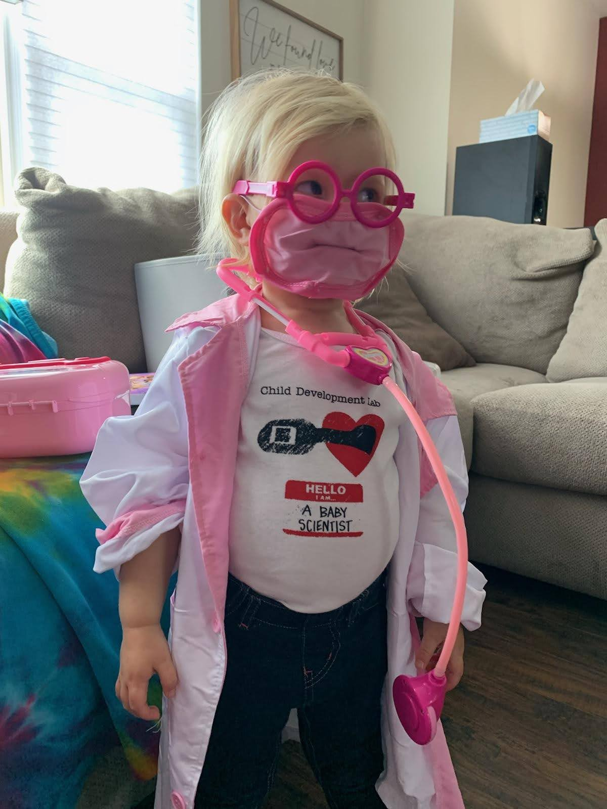

```{r lablogo, echo=FALSE,  out.width = '75%', fig.align = 'center'}

knitr::include_graphics("images/lablogo.png")
```


## Research in the data collection phase 

**Parental Expectations and Infants' Sleep during COVID-19**

  We are using a survey and still accepting responses!
  https://gccuny.az1.qualtrics.com/jfe/form/SV_1Mknip2xlCEntjv 


**Longitudinal Assessment of Sleep and Motor Milestone Acquisition.** 

  By using Nanit video baby monitors and parent reported motor skill diaries, we get a prospective glimpse into infants' sleep around the acquisition of new motor skills including rolling, sitting, crawling, and walking. Preliminary results are in the conference presentations below!
  

**Supported vs Unsupported Sitters and Focused Attention**

  Parents and their babies participate entirely on Zoom. We're interested in what we can learn about movement and cognition while your baby sits and plays with toys from your house. 


**Novel Methodological Techniques for Coding Sleep States in Infancy**

  I developed a technique using wireless cardiorespiratory sensors and an actigraph to code infant sleep states. The procedure is easy enough for parents to incorporate into their usual bedtime routines. Parents and babies become part of the research team! 


```{r babysci, echo=FALSE,  out.width = '40%', fig.align = 'center'}


```


## Completed research projects 

**Learning to Solve a Novel Locomotor Problem in Infancy: Does Sleep Play a Role?**

**The Role of Motor Experience on Whole-Body Exploration and Problem Solving**

**The Relation Between Physical Space and Young Children’s Play: A Cross-Cultural Examination**


## Recent conference presentations


```{r isdp20, echo=FALSE,  out.width = '60%'}

knitr::include_graphics("images/twitterposter.gif")
```
```


```{r icis, echo=FALSE,  out.width = '60%'}

knitr::include_graphics("images/prepforlearn.png")
```


```{r sleep, echo=FALSE,  out.width = '60%'}

knitr::include_graphics("images/SLEEP.png")
```


```{r icis20, echo=FALSE,  out.width = '60%'}

knitr::include_graphics("images/icis20.png")
```


```{r psm19, echo=FALSE,  out.width = '60%'}

knitr::include_graphics("images/psm19.png")
```


